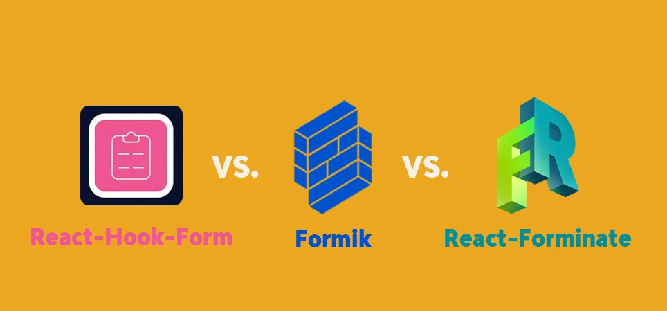

## Introduction

In the world of React development, form handling has long meant choosing between verbose boilerplate (Formik) or complex validation setups (React-Hook-Form). But what if you could achieve better results with 70% less code? Enter React-Forminate – a game-changer that delivers powerful validation, seamless state management, and clean syntax through a revolutionary declarative approach. Let’s examine how it outperforms traditional solutions while requiring dramatically less effort.
{/* truncate */}

Let's compare three popular approaches:

1. **Formik + Yup** - The established combination
2. **React-Hook-Form + Zod** - The performance-focused stack
3. **React-Forminate** - The new declarative solution with built-in validation

## Implementation Comparison

### 1. React-Hook-Form + Zod

```bash
npm i react-hook-form @hookform/resolvers zod
```
[Click to see: react-hook-form on NPM](https://www.npmjs.com/package/react-hook-form)

```tsx
import { useForm } from "react-hook-form";
import { zodResolver } from "@hookform/resolvers/zod";
import { z } from "zod";
import { ReactNode } from "react";

const signupSchema = z
  .object({
    firstName: z
      .string()
      .max(15, "Must be 15 characters or less")
      .nonempty("This field is required."),
    lastName: z
      .string()
      .max(20, "Must be 20 characters or less")
      .nonempty("This field is required."),
    email: z
      .string()
      .email("Invalid email address")
      .nonempty("This field is required."),
    password: z
      .string()
      .nonempty("Password is required")
      .min(8, "Password must be at least 8 characters")
      .regex(
        /^(?=.*[a-z])(?=.*[A-Z])(?=.*\d)(?=.*[@$!%*?&])[A-Za-z\d@$!%*?&]+$/,
        "Password must contain at least one uppercase, one lowercase, one number and one special character"
      ),
    comparePassword: z.string().nonempty("Please confirm your password"),
  })
  .refine((data) => data.password === data.comparePassword, {
    message: "Passwords must match",
    path: ["comparePassword"],
  });

type SignupFormData = z.infer<typeof signupSchema>;

const SignupForm = () => {
  const {
    register,
    handleSubmit,
    formState: { errors },
  } = useForm<SignupFormData>({
    resolver: zodResolver(signupSchema),
    mode: "onBlur",
  });

  const onSubmit = (data: SignupFormData) => {
    alert(JSON.stringify(data, null, 2));
  };

  // Helper component for required field labels
  const RequiredLabel = ({
    htmlFor,
    children,
  }: {
    htmlFor: string;
    children: ReactNode;
  }) => (
    <label
      htmlFor={htmlFor}
      className="block text-sm font-medium text-gray-700"
    >
      {children} <span className="text-red-500">*</span>
    </label>
  );

  return (
    <form onSubmit={handleSubmit(onSubmit)}>
      <div className="space-y-2.5">
        <div className="space-y-2">
          <RequiredLabel htmlFor="firstName">First Name</RequiredLabel>
          <input
            id="firstName"
            type="text"
            {...register("firstName")}
            className="w-full px-3 py-2 border border-gray-300 rounded-md shadow-sm focus:outline-none focus:ring-2 focus:ring-blue-500"
          />
          {errors.firstName && (
            <div className="text-sm text-red-600">
              {errors.firstName.message}
            </div>
          )}
        </div>

        <div className="space-y-2">
          <RequiredLabel htmlFor="lastName">Last Name</RequiredLabel>
          <input
            id="lastName"
            type="text"
            {...register("lastName")}
            className="w-full px-3 py-2 border border-gray-300 rounded-md shadow-sm focus:outline-none focus:ring-2 focus:ring-blue-500"
          />
          {errors.lastName && (
            <div className="text-sm text-red-600">
              {errors.lastName.message}
            </div>
          )}
        </div>

        <div className="space-y-2">
          <RequiredLabel htmlFor="email">Email Address</RequiredLabel>
          <input
            id="email"
            type="email"
            {...register("email")}
            className="w-full px-3 py-2 border border-gray-300 rounded-md shadow-sm focus:outline-none focus:ring-2 focus:ring-blue-500"
          />
          {errors.email && (
            <div className="text-sm text-red-600">{errors.email.message}</div>
          )}
        </div>

        <div className="space-y-2">
          <RequiredLabel htmlFor="password">Password</RequiredLabel>
          <input
            id="password"
            type="password"
            {...register("password")}
            className="w-full px-3 py-2 border border-gray-300 rounded-md shadow-sm focus:outline-none focus:ring-2 focus:ring-blue-500"
          />
          {errors.password && (
            <div className="text-sm text-red-600">
              {errors.password.message}
            </div>
          )}
        </div>

        <div className="space-y-2 mb-4.5">
          <RequiredLabel htmlFor="comparePassword">
            Confirm Password
          </RequiredLabel>
          <input
            id="comparePassword"
            type="password"
            {...register("comparePassword")}
            className="w-full px-3 py-2 border border-gray-300 rounded-md shadow-sm focus:outline-none focus:ring-2 focus:ring-blue-500"
          />
          {errors.comparePassword && (
            <div className="text-sm text-red-600">
              {errors.comparePassword.message}
            </div>
          )}
        </div>

        <button
          type="submit"
          className="px-4 py-2 bg-[#0457aa] cursor-pointer text-white rounded-md hover:bg-blue-700 focus:outline-none focus:ring-2 focus:ring-blue-500 focus:ring-offset-2"
        >
          Submit
        </button>
      </div>
    </form>
  );
};

const ReactHookForm = () => {
  return <SignupForm />;
};

export default ReactHookForm;
```

### 2. Formik + Yup

```bash
npm i formik yup
```

[Click to see: Formik on NPM](https://www.npmjs.com/package/formik)

```typescript
import { useFormik } from "formik";
import { ReactNode } from "react";
import * as Yup from "yup";

const SignupForm = () => {
  const formik = useFormik({
    initialValues: {
      firstName: "",
      lastName: "",
      email: "",
      password: "",
      comparePassword: "",
    },
    validationSchema: Yup.object({
      firstName: Yup.string()
        .max(15, "Must be 15 characters or less")
        .required("This field is required."),
      lastName: Yup.string()
        .max(20, "Must be 20 characters or less")
        .required("This field is required."),
      email: Yup.string()
        .email("Invalid email address")
        .required("This field is required."),
      password: Yup.string()
        .required("Password is required")
        .min(8, "Password must be at least 8 characters")
        .matches(
          /^(?=.*[a-z])(?=.*[A-Z])(?=.*\d)(?=.*[@$!%*?&])[A-Za-z\d@$!%*?&]+$/,
          "Password must contain at least one uppercase, one lowercase, one number and one special character"
        ),
      comparePassword: Yup.string()
        .required("Please confirm your password")
        .oneOf([Yup.ref("password")], "Passwords must match"),
    }),
    onSubmit: (values) => {
      alert(JSON.stringify(values, null, 2));
    },
  });

  // Helper component for required field labels
  const RequiredLabel = ({
    htmlFor,
    children,
  }: {
    htmlFor: string;
    children: ReactNode;
  }) => (
    <label
      htmlFor={htmlFor}
      className="block text-sm font-medium text-gray-700"
    >
      {children} <span className="text-red-500">*</span>
    </label>
  );

  return (
    <form onSubmit={formik.handleSubmit}>
      <div className="space-y-2.5">
        <div className="space-y-2">
          <RequiredLabel htmlFor="firstName">First Name</RequiredLabel>
          <input
            id="firstName"
            name="firstName"
            type="text"
            onChange={formik.handleChange}
            onBlur={formik.handleBlur}
            value={formik.values.firstName}
            className="w-full px-3 py-2 border border-gray-300 rounded-md shadow-sm focus:outline-none focus:ring-2 focus:ring-blue-500"
          />
          {formik.touched.firstName && formik.errors.firstName ? (
            <div className="text-sm text-red-600">
              {formik.errors.firstName}
            </div>
          ) : null}
        </div>

        <div className="space-y-2">
          <RequiredLabel htmlFor="lastName">Last Name</RequiredLabel>
          <input
            id="lastName"
            name="lastName"
            type="text"
            onChange={formik.handleChange}
            onBlur={formik.handleBlur}
            value={formik.values.lastName}
            className="w-full px-3 py-2 border border-gray-300 rounded-md shadow-sm focus:outline-none focus:ring-2 focus:ring-blue-500"
          />
          {formik.touched.lastName && formik.errors.lastName ? (
            <div className="text-sm text-red-600">{formik.errors.lastName}</div>
          ) : null}
        </div>

        <div className="space-y-2">
          <RequiredLabel htmlFor="email">Email Address</RequiredLabel>
          <input
            id="email"
            name="email"
            type="email"
            onChange={formik.handleChange}
            onBlur={formik.handleBlur}
            value={formik.values.email}
            className="w-full px-3 py-2 border border-gray-300 rounded-md shadow-sm focus:outline-none focus:ring-2 focus:ring-blue-500"
          />
          {formik.touched.email && formik.errors.email ? (
            <div className="text-sm text-red-600">{formik.errors.email}</div>
          ) : null}
        </div>

        <div className="space-y-2">
          <RequiredLabel htmlFor="password">Password</RequiredLabel>
          <input
            id="password"
            name="password"
            type="password"
            onChange={formik.handleChange}
            onBlur={formik.handleBlur}
            value={formik.values.password}
            className="w-full px-3 py-2 border border-gray-300 rounded-md shadow-sm focus:outline-none focus:ring-2 focus:ring-blue-500"
          />
          {formik.touched.password && formik.errors.password ? (
            <div className="text-sm text-red-600">{formik.errors.password}</div>
          ) : null}
        </div>

        <div className="space-y-2 mb-4.5">
          <RequiredLabel htmlFor="comparePassword">
            Confirm Password
          </RequiredLabel>
          <input
            id="comparePassword"
            name="comparePassword"
            type="password"
            onChange={formik.handleChange}
            onBlur={formik.handleBlur}
            value={formik.values.comparePassword}
            className="w-full px-3 py-2 border border-gray-300 rounded-md shadow-sm focus:outline-none focus:ring-2 focus:ring-blue-500"
          />
          {formik.touched.comparePassword && formik.errors.comparePassword ? (
            <div className="text-sm text-red-600">
              {formik.errors.comparePassword}
            </div>
          ) : null}
        </div>

        <button
          type="submit"
          className="px-4 py-2 bg-[#0457aa] cursor-pointer text-white rounded-md hover:bg-blue-700 focus:outline-none focus:ring-2 focus:ring-blue-500 focus:ring-offset-2"
        >
          Submit
        </button>
      </div>
    </form>
  );
};

const ReactFormik = () => {
  return <SignupForm />;
};

export default ReactFormik;
```

### 3. React-Forminate

```bash
npm i react-forminate
```

[Click to see: React-Forminate on NPM](https://www.npmjs.com/package/react-forminate)


```typescript
import { DynamicForm, FormDataCollectionType } from "react-forminate";

const SignupForm = () => {
  const commonStyling = {
    disableDefaultStyling: true,
    containerClassName: "space-y-2",
    className:
      "w-full px-3 py-2 border border-gray-300 rounded-md shadow-sm focus:outline-none focus:ring-2 focus:ring-blue-500",
    labelClassName: "block text-sm font-medium text-gray-700 mb-2",
  };
  const formData: FormDataCollectionType = {
    formId: "signupForm",
    title: "Signup Form",
    fields: [
      {
        fieldId: "firstName",
        type: "text",
        label: "First Name",
        required: true,
        validation: [
          {
            maxLength: 15,
            message: "Must be 15 characters or less",
          },
        ],
        ...commonStyling,
      },
      {
        fieldId: "lastName",
        type: "text",
        label: "Last Name",
        required: true,
        validation: [
          {
            maxLength: 20,
            message: "Must be 20 characters or less",
          },
        ],
        ...commonStyling,
      },
      {
        fieldId: "email",
        type: "email",
        label: "Email Address",
        required: true,
        validation: [{ type: "email", message: "Invalid email address" }],
        ...commonStyling,
      },
      {
        fieldId: "password",
        type: "password",
        label: "Password",
        required: true,
        validation: [{ type: "password" }],
        ...commonStyling,
      },
      {
        fieldId: "confirmPassword",
        type: "password",
        label: "Confirm Password",
        required: true,
        validation: [
          {
            type: "equalTo",
            equalTo: "{{password}}", // Reference to the password field
            message: "Passwords must match", // Custom error message
          },
        ],
        ...commonStyling,
      },
    ],
  };

  const onSubmit = (value: any, isValid: boolean) => {
    console.log("value", value);

    if (isValid) {
      alert(JSON.stringify(value, null, 2));
    }
  };

  return <DynamicForm formData={formData} onSubmit={onSubmit} />;
};

const ReactForminateForm = () => {
  return <SignupForm />;
};

export default ReactForminateForm;
```

## Feature Comparison

| Feature                 | Formik + Yup | RHF + Zod | React-Forminate      |
| ----------------------- | ------------ | --------- | -------------------- |
| **Lines of Code**       | 120+         | 130+      | 30-50                |
| **Built-in Validation** | ❌           | ❌        | ✅                   |
| **Declarative API**     | ❌           | ❌        | ✅                   |
| **Performance**         | ❌           | ✅        | ✅                   |
| **Schema Required**     | ✅           | ✅        | ❌                   |
| **Field Dependencies**  | Complex      | Complex   | Simple (`{{field}}`) |
| **Learning Curve**      | Steep        | Medium    | Gentle               |

## Pros and Cons Analysis

### Formik + Yup

**✅ Pros:**

- Mature ecosystem
- Good documentation
- Flexible for complex forms

**❌ Cons:**

- Verbose implementation
- Performance issues with large forms
- Requires learning two libraries
- Manual error handling

### React-Hook-Form + Zod

**✅ Pros:**

- Excellent performance
- Strong type safety
- Active community

**❌ Cons:**

- Complex setup
- Schema definition gets verbose
- Steeper learning curve
- Boilerplate code

### React-Forminate

(Last but not least)

**✅ Pros:**

- Minimal boilerplate
- Built-in validation
- Declarative configuration
- Automatic error handling
- Field reference system
- Consistent styling approach
- Faster development cycle

**❌ Cons:**

- Newer library (smaller community)
- Less customization for edge cases
- Requires adopting its paradigm

## Why React-Forminate Stands Out

1. **Developer Experience**  
   React-Forminate reduces form implementation code by 60-70% compared to alternatives. The declarative approach means you describe what you want rather than how to implement it.

2. **Built-in Best Practices**  
   Validation, error handling, and form state management come pre-configured with sensible defaults.

3. **Consistent Architecture**  
   Unlike mixing Formik/Yup or RHF/Zod, React-Forminate provides a unified solution where all parts are designed to work together seamlessly.

4. **Rapid Prototyping**  
   You can build complete, production-ready forms in minutes rather than hours.

5. **Maintainability**  
   The configuration-centric approach makes forms easier to modify and reason about.

## Conclusion

While all three solutions are capable, React-Forminate offers significant advantages in:

- **Development speed** - Build forms 3-4x faster
- **Code maintainability** - 70% less code to manage
- **Learning efficiency** - New developers become productive quicker
- **Consistency** - Standardized form patterns across your application

For projects where developer productivity and clean code matter, React-Forminate represents the next evolution of form management in React.
